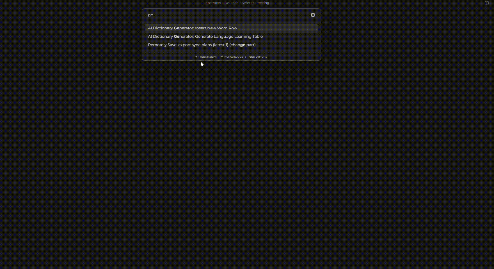

# AI-DICTIONARY-GEN


A smart table generator plugin with AI-powered data filling using Gemini or self hosted models. Helps in language learning by automating translations, transcriptions and definitions.

## Features

-   🚀 Auto-generate tables with customizable columns
-   🤖 Gemini AI integration for instant data filling
-   🌍 Support for any language pairs (e.g. English-Russian)
-   🔧 Flexible table configuration
-   ⚡ Quick word insertion with auto-completion

## Configuration

1. Get Gemini API Key: [Google AI Studio](https://aistudio.google.com/)
2. In plugin settings provide:
    - Gemini API Key (working on adding ollama for self hosting)
    - Native and learning languages (full names)
    - Language codes (e.g. ru, en)
    - Desired table columns

## Usage

### Create New Table

1. Open command palette (Ctrl/Cmd+P)
2. Find "Generate Language Learning Table"
3. Select desired columns
4. Configure language settings

### Add New Word

1. Place cursor in target location
2. Execute "Insert Word Row" command
3. Enter word in target language
4. Select target table

The plugin will automatically fill all the rest with ai

## Example Table

```markdown
| Word en | Translation ru | Transcription | Description |
| ------- | -------------- | ------------- | ----------- |
| apple   | яблоко         | ˈæp.əl        | fruit       |
```

Table usage history

Tips
🔹 Use short language codes (ISO 639-1) for better AI performance
🔹 Combine with spaced repetition plugins
